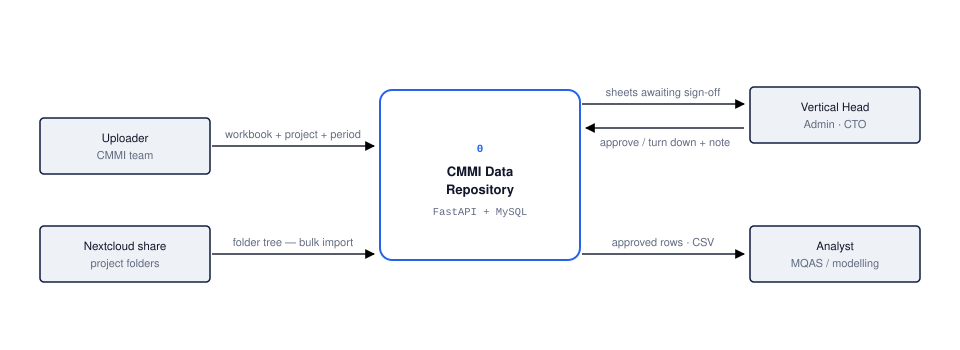
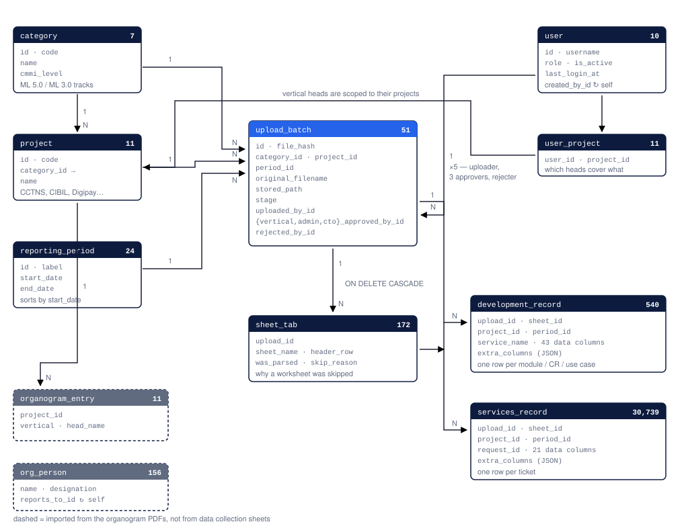

# Diagrams

Data flow and entity relationships for the CMMI data collection repository, drawn
from the running schema and the route handlers rather than from an intended design.
Row counts are as at 9 October 2026.

The `.svg` files are standalone — open them in a browser, or drop them straight
into a Word document or a slide.

| File | Shows |
|---|---|
| [`01-context-diagram.svg`](01-context-diagram.svg) | Who hands the system something, and what they get back |
| [`02-dfd-level-1.svg`](02-dfd-level-1.svg) | The path from an uploaded workbook to a queryable row |
| [`03-approval-chain.svg`](03-approval-chain.svg) | The four values `upload_batch.stage` moves through |
| [`04-er-diagram.svg`](04-er-diagram.svg) | All eleven tables and their foreign keys |

## 1. Context



One process, four external entities. Approved rows are the only thing that
leaves: Browse and CSV export filter on `stage = 'approved'`, so a sheet sitting
at any of the three approval stages is invisible to the analyst even though its
rows are already stored.

## 2. Level 1 — what happens to a workbook


Five processes, each writing to its own store.

Rows land in `development_record` / `services_record` at step 3, **before**
anyone approves anything. Approval only flips a column on `upload_batch`, which
is why step 5 has to join back to the batch — the rows themselves carry no
approved flag, so that join is what keeps unapproved data out of an export.

## 3. The approval chain


```
pending_vertical ──▶ pending_admin ──▶ pending_cto ──▶ approved
       │                   │                │
       └───────────────────┴────────────────┴──▶ rejected
```

Each stage belongs to exactly one role, so no one can sign twice — an
administrator cannot also give the vertical head's approval. There is no path
back from `rejected`: a turned-down sheet is corrected outside the system and
uploaded again as a new batch, which is why the rejection reason stays on the
old row rather than being cleared.

A sheet reaching `approved` marks any earlier sheet for the same project and
period as superseded rather than deleting it.

## 4. Entity relationships



Eleven tables. The three reference tables on the left are seeded once by
`scripts/init_db.py`; everything to the right of them is written by an upload.

Both record tables carry `project_id` and `period_id` even though
`upload_batch` already has them. That is deliberate denormalisation — it lets a
modelling query group 30,739 service rows by period without a join.

`organogram_entry` and `org_person` are drawn dashed because they come from the
organogram files, not from data collection sheets.

## Four things the diagrams imply

- **There is no activity or audit table.** The Activity page is derived at
  request time from the timestamp columns on `upload_batch` and `user` — one
  batch row produces up to five dated events. Those columns are the record of
  truth, so the trail cannot drift from what it describes.
- **Deleting an upload deletes its history.** `sheet_tab` and both record tables
  cascade from `upload_batch`, and the batch row carries the approvals, so a
  `DELETE` removes the upload, its rows and its sign-offs together. Only an
  administrator can delete.
- **Row identity is the file plus the row's own name** — `service_name` for
  Development, `request_id` for Services. Both pairs are indexed but neither is
  unique: Request IDs genuinely repeat in the Services logs, so a unique key
  would reject real rows.
- **Nothing is discarded on the way in.** A heading the catalogue does not
  recognise goes to `extra_columns` as JSON and is flagged on the upload page; a
  worksheet that is not a data collection sheet still gets a `sheet_tab` row
  recording why it was skipped.

## Regenerating

The diagrams are hand-authored SVG. Edit the `.svg` files directly — there is no
build step and no diagramming tool in the loop.
